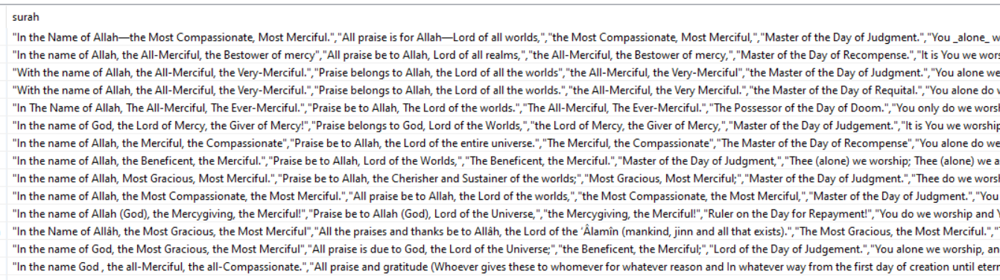
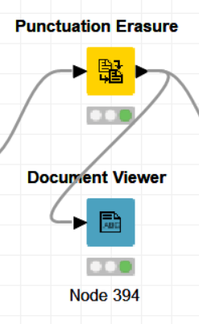
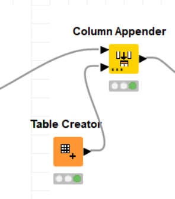

# Knime-codeless-Al-quran-Test
## Overview
****The project is a text mining project which uses Ayah Al-Qur'an Surah Al-Fatihah for text mining by taking the text that each translator translates to find the similarity. By using the process of text mining, in text mining we used the knime program in text mining which was the first project. which the benefits of this project It is able to do a search engine that will be able to search the meaning and find the meaning of other translators as well.****
## Method
**first step Import Excel file into knime using node Excel reader.**

  

## Tranform Data

  

1. Using Node Column Filter.

  

* to remove a column that is not removed.

  

2. Using node Transpose.

  

**Before**

  

**After**

  

3. Using node Column Combiner.

  

* Combine 7 columns into one column. and one new column will be added.

  

**Result**

  

4. Using node Colum Filter.

  

* Remove all 6 columns and leave 1. Included columns.

  

**Result**

  

5. Using node Column Appender + Node  Table Creator.

  

* These 2 will add a new ID.

  

6. Using node String Manipulation.

  

* Delete the dash or this – dash because it is not necessary.

**Before**

  

**After**

  

## Text Proccessing

  

1. Using node String to document .

  

* to change string to document 

  

2. Using node Column Filter .

  

* to remove unuse column 

  

**Result**

  

3. Using node Punctuation Erasure.

  

* to remove punctuation (? , . () , : ; "") 
 
 **Before**
 

  

**After**

  

4. Using node Case Converter.

  

* to change all character to be lowercase letter

5. Using node Stop Word Filter.

  

* to remove stop word.

6. Using node POS Tagger, node Stanford.

  

* to separate word Part of speech(nouns ,verbs , adverb etc.)

7. Using node Standford Lammatizer.

  

* to make the verb to be base form

8. Using node Bag of Word Creator .

  

* to create bag of word

## Model
1. Using Node TF Node IDF.
*  Model Use TF and IDE to find word frequencies.
2. Using Node Math Formula.
*  To TF and IDF are multiplied gether for more accurate results.

  

**Result**

  

3. Using Node Document Vector.

  

* 
**Result**

  

## Similarity View(TF-IDF)

  

1. Add Column And Sort Column By ID

  

2. Similarity View

  

* Determines the translator to compare the similarity use Column ID.
